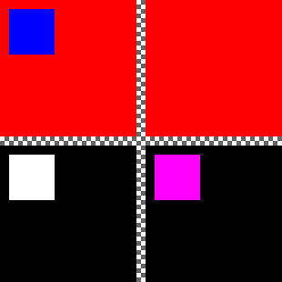

# Image drawer 2D

Library allowing to draw simple 2D shapes and store it as image. Main purpose of the library is to visualise and test data in unit tests while avoiding use of additional libraries.

## Features
- drawing shapes: line, circle, rectangle
- storing as PNG
- comparing images
- visualising difference between images

## Example of shapes

## Example of generated diff image

Example presents difference of two images. Result consists of four *subimages*:
- on upper left corner: test image
- upper right corner: reference image
- lower right corner: difference between two images
- lower left corner: mask of differences

## Dependencies

Library depends on following components:
- libpng++
