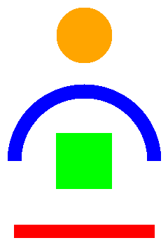

# Image drawer 2D

Library allowing to draw simple 2D shapes and store it as image. Main purpose of the library is to visualise and unit test data while avoiding use of additional heavy libraries.


## Features

- drawing shapes: line, circle, rectangle, clothoid(Euler spiral)
- storing as PNG
- comparing images
- visualising difference between images


## Example of shapes




## Example of generated diff image


Example presents difference of two images. Result consists of four *subimages*:
- on upper left corner: test image
- upper right corner: reference image
- lower right corner: difference between two images
- lower left corner: mask of differences


## Code examples

Code snipets and examples can be found in unit testing direcotry: ```src/imgdraw2d/tests```


## Building library

```
cd <path_to_build_dir>
cmake -DCMAKE_BUILD_TYPE=Release -DCMAKE_INSTALL_PREFIX=<path_to_install_dir> <path_to_src_dir>
make install
```
where:
- ```path_to_src_dir``` is directory where library sources (content of *src* dir)
- ```path_to_build_dir``` is directory where sources will be build
- ```path_to_install_dir``` is directory where compilation artefacts (binaries and headers) will be deployed


## Using library

To use library in project append library install directory path to ```CMAKE_MODULE_PATH``` variable amd then use ```find_package``` function as follows:
```
list(APPEND CMAKE_MODULE_PATH "<path_to_install_dir>/cmake/Modules")
find_package( imgdraw2d )

message("imgdraw2d library: ${imgdraw2d_FOUND} ${imgdraw2d_INCLUDE_DIR} ${imgdraw2d_LIBRARY}")
```
After that three new variables will be available:
- ```imgdraw2d_FOUND``` boolean indicating if library has been found
- ```imgdraw2d_INCLUDE_DIR``` path to include directory
- ```imgdraw2d_LIBRARY``` path to binary file


## ToDo

- write text on image
- draw scale/measure


## Dependencies

Library depends on following components:
- libpng++


## References
- https://en.wikipedia.org/wiki/Euler_spiral
